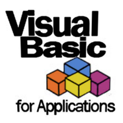

### Hi there 👋 I'm thanai from (dev.)thanaism.com

<!-- バッジ関連 -->
<!--
メイン：https://shields.io/category/social
GitHub view：https://github.com/antonkomarev/github-profile-views-counter
Qiita contributions：https://qiita.com/mikkame/items/f2c60d9caf8a8e38ec50
 -->

🍎 **My GitHub overview ...**

<!-- GitHubトロフィー -->
<!--
https://github.com/ryo-ma/github-profile-trophy
 -->

<!-- [](https://github.com/thanaism/thanaism) -->

<!-- GitHubステータス -->
<!--
https://github.com/anuraghazra/github-readme-stats
 -->

[](https://github.com/thanaism/thanaism)

<!-- [](https://github.com/thanaism/thanaism) -->

<!-- Skill icons -->
<!--
https://rahuldkjain.github.io/gh-profile-readme-generator/
 -->

🌱 **I’m currently learning ...**

<!-- #### Language and Tools -->

<p align="left">
  <!-- python -->
  
  <!-- vba -->
  
  <!-- javascript -->
  
  <!-- typescript -->
  
  <!-- git -->
  
  <!-- html5 -->
  
  <!-- css3 -->
  
  <!-- swift -->
  
</p>
<p align="left">
  <!-- gatsby -->
  
  <!-- react -->
  
  <!-- nodejs -->
  
  <!-- selenium -->
  
  <!-- amplify -->
  
  <!-- django -->
  
  <!-- aws -->
  
</p>

💻 **Contributions overview ...**

<p align="left">

  <a href="https://github.com/thanaism/thanaism/">
    
  </a>
  <a href="http://twitter.com/okinawa__noodle">
    
  </a>
  <a href="https://github.com/thanaism">
    
  </a>
  <!-- <a href="https://www.reddit.com/user/thanaism">
    
  </a>
  <a href="https://stackoverflow.com/users/5720201/thanaism">
     -->
  </a>
  <a href="http://qiita.com/thanai">
    
  </a>
  <//qiita.com/thanai">
    
  </a>
</p>

<!--START_SECTION:waka-->
**🐱 My Github Data** 

> 🏆 10 Contributions in the Year 2021
 > 
> 📦 20.0 kB Used in Github's Storage 
 > 
> 🚫 Not Opted to Hire
 > 
> 📜 11 Public Repositories 
 > 
> 🔑 2 Private Repositories  
 > 
**I'm an Early 🐤** 

```text
🌞 Morning    127 commits    █████████████░░░░░░░░░░░░   54.04% 
🌆 Daytime    76 commits     ████████░░░░░░░░░░░░░░░░░   32.34% 
🌃 Evening    29 commits     ███░░░░░░░░░░░░░░░░░░░░░░   12.34% 
🌙 Night      3 commits      ░░░░░░░░░░░░░░░░░░░░░░░░░   1.28%

```
📅 **I'm Most Productive on Wednesday** 

```text
Monday       29 commits     ███░░░░░░░░░░░░░░░░░░░░░░   12.34% 
Tuesday      26 commits     ██░░░░░░░░░░░░░░░░░░░░░░░   11.06% 
Wednesday    116 commits    ████████████░░░░░░░░░░░░░   49.36% 
Thursday     24 commits     ██░░░░░░░░░░░░░░░░░░░░░░░   10.21% 
Friday       15 commits     █░░░░░░░░░░░░░░░░░░░░░░░░   6.38% 
Saturday     10 commits     █░░░░░░░░░░░░░░░░░░░░░░░░   4.26% 
Sunday       15 commits     █░░░░░░░░░░░░░░░░░░░░░░░░   6.38%

```


📊 **This Week I Spent My Time On** 

```text
💬 Programming Languages: 
Markdown                 52 mins             █████████████████████████   100.0%

🔥 Editors: 
VS Code                  52 mins             █████████████████████████   100.0%

🐱‍💻 Projects: 
Unknown Project          52 mins             █████████████████████████   99.82% 
dev.thanaism             0 secs              ░░░░░░░░░░░░░░░░░░░░░░░░░   0.18%

💻 Operating System: 
Mac                      52 mins             █████████████████████████   100.0%

```

**I Mostly Code in Python** 

```text
Python                   5 repos             ███████████░░░░░░░░░░░░░░   45.45% 
TypeScript               3 repos             ██████░░░░░░░░░░░░░░░░░░░   27.27% 
JavaScript               1 repo              ██░░░░░░░░░░░░░░░░░░░░░░░   9.09% 
Swift                    1 repo              ██░░░░░░░░░░░░░░░░░░░░░░░   9.09% 
VBA                      1 repo              ██░░░░░░░░░░░░░░░░░░░░░░░   9.09%

```


<!--END_SECTION:waka-->
